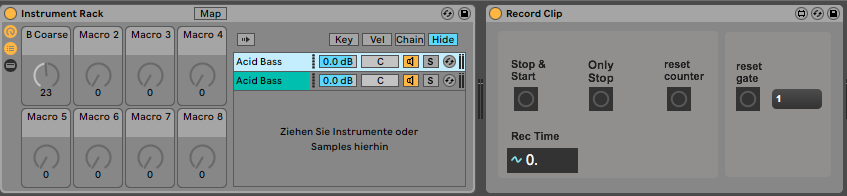
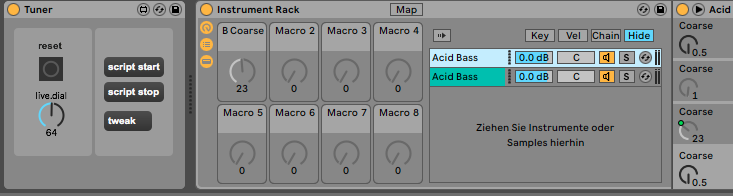

# CNN
Training data is in the data-in folder. Limitation, can be trained for one specific synth knob.

# Reinforcement

## Test Setup
Two synthesizers are organized in a rack. One is phase inverted. At the same settings both synths cancel each other out. The difference is recorded. 

The AI tweaks the first chain and gets rewarded if the sum of outputs is lower than before. 

- *Still trying out if this works*

# Notices

- Use this module with [nodejs-spectrogram](https://github.com/sonic-empire/nodejs-spectrogram)
- M4L patches:
  - [VST-tuner](https://github.com/sonic-empire/vst-tuner)
  - [Recorder](https://github.com/sonic-empire/record-clip)

# Usefule ressources

- [ReImproveJS](https://github.com/BeTomorrow/ReImproveJS/blob/master/docs/README.md)
- [MetaCar](https://www.metacar-project.com)
